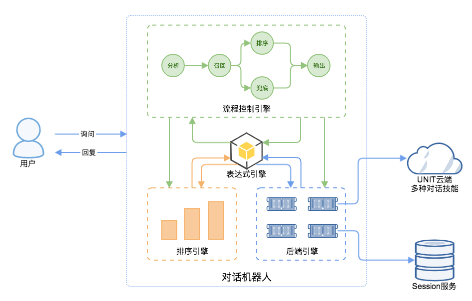

# USKit

## 简介

在真实的对话系统中，通常会要求同时支持多种对话技能，比如育儿对话机器人中要求同时支持音乐、故事、古诗、百科等技能。这涉及到多个技能的管理、召回、排序和选择等策略，在具体的实现中，通常由一个统一调度对话中控US (Unified Scheduler) 来提供这些能力。

USKit作为UNIT的开源对话中控模块，主要负责多个对话技能的接入、调度、排序、选择、回复生成以及多轮对话session的管理，无缝对接UNIT平台能力，可以方便开发者通过配置快速搭建和定制符合自己业务场景的对话中控，将多种技能整合为统一的对话机器人为用户提供服务。

## 主要功能

### 核心概念
在开始之前，我们先定义以下两个概念：

1. 对话技能(bot skill)：指某个特定场景下的对话能力，一个对话技能对应一个具体的对话场景，比如天气技能负责提供天气场景下的对话能力。
2. 对话机器人(bot service)：由多个对话技能整合而成的统一对话服务，可以同时支持多个对话场景的人机对话，一个对话机器人对应一个具体业务的整体解决方案，比如车载对话机器人、育儿对话机器人等。USKit提供的正是快速搭建对话机器人的能力。

### 功能介绍
USKit作为UNIT的开源中控模块，通过配置驱动和内置表达式运算支持，提供了以下能力：

* 支持配置表达式运算，内置常用函数，提供丰富的表达能力，通过修改配置即可轻松实现策略的定制
* 支持定义后端服务的请求构造和接入策略(后端服务泛指各种通过网络访问的远程服务，比如UNIT技能、DMKit服务、Redis session服务等)，支持的通信协议包括HTTP和Redis
* 支持定义后端服务结果的抽取(extract)和变换(transform)策略
* 支持定义多种对话技能的排序(ranking)和选择策略
* 支持定义对话中控流程(chatflow)策略
* 内置UNIT技能协议请求构造和结果解析策略的配置支持，只需配置技能id即可实现对话技能的快速接入

## 架构

USKit针对对话中控的能力做了抽象，抽取出不同对话场景中下中控的通用能力，避免不必要的重复开发。同时按照配置化驱动和高扩展性的思想进行整体架构的设计，方便开发者通过配置快速构建和定制适用于特定业务场景的对话中控。USKit的整体架构如下图：



系统主要由以下4个核心部分组成：
* 表达式引擎：负责表达式的解析和执行求值，详细的运算支持可以参见[配置表达式运算支持](docs/expression.md)，表达式引擎为下面三个引擎提供了基础支持，基于表达式引擎，可以实现根据用户请求动态生成配置
* 后端服务管理引擎：负责后端服务的接入、请求构造和结果解析抽取等策略的管理，通过`backend.conf`进行策略的配置
* 排序策略管理引擎：负责技能的排序规则的管理，用于多技能的排序，通过`rank.conf`进行策略的配置
* 对话流程管理引擎：负责对话中控流程的策略的管理，用于定义机器人中控的逻辑执行流程：包括调用后端服务引擎召回技能(recall)、调用排序引擎进行技能排序(rank)、结果选择和输出等，通过`flow.conf`进行策略的配置

开发者在使用USKit的时候，只需配置上述3个配置文件，即可完成对话中控的搭建，后续策略的变动和升级也通过修改配置文件即可完成，可以让开发者关注对话机器人中控本身的策略逻辑，不需要重复开发框架代码

3个配置文件的详细说明可以参考[详细配置说明](docs/config.md)

## 安装

### 编译

从GitHub获取USKit的源代码:

```
git clone https://github.com/baidu/unit-uskit.git
cd unit-uskit
```

#### 安装依赖

USKit基于以下工具包进行开发：
* [brpc](https://github.com/brpc/brpc)
* protobuf
* flex >= 2.6.4
* bison >= 3.0.4
* cmake >= 2.8.10

目前支持macOS，Ubuntu，CentOS等系统环境，Ubuntu 推荐使用16.04或以上版本，CentOS 推荐使用7以上版本， 编译USKit前请确保对应版本的依赖已经正确安装：

##### macOS
```
sh deps.sh macos
```

##### Ubuntu
```
sh deps.sh ubuntu

```
##### CentOS
```
sh deps.sh centos
```

#### 编译USKit

```
mkdir _build && cd _build && cmake .. && make
```

如果希望打印更多Debug信息，可以在生成执行cmake时指定为Debug，在运行USKit的过程中将会打出更详细的log信息，方便问题定位

```
mkdir _build && cd _build && cmake -DCMAKE_BUILD_TYPE=Debug .. && make
```

注：打开该选项会影响性能，建议只在开发环境中使用

#### USKit代码目录结构
```
.
├── CMakeLists.txt
├── README.md
├── _build             # 编译产出，在该目录下修改配置文件以及运行./uskit启动服务
│   ├── conf           # 配置目录
│   │   ├── us         # 对话机器人的配置，每个子目录对应一个具体业务场景下的对话机器人
│   │   │   └── demo   # USKit教程示例的配置及配置生成工具
│   │   │       ├── backend.conf       # demo场景后端服务策略配置，包含UNIT的请求和解析策略
│   │   │       ├── rank.conf          # demo场景技能排序策略配置
│   │   │       ├── flow.conf          # demo场景中控流程策略配置
│   │   │       ├── conf_generator.py  # 根据options.py里声明的配置，自动生成上述3个配置文件
│   │   │       └── options.py         # demo场景里需要开发者自行配置的选项，如技能id，API Key等
│   │   └── us.conf                    # USKit本身相关的配置，用于指定加载的对话机器人
│   └── uskit          # USKit主程序
├── conf               # 配置目录，编译成功后会被复制到_build/conf
├── docs               # 详细文档
├── proto              # protobuf相关
├── src                # 源代码
└── third_party        # 第三方依赖brpc和rapidjson需要被放置在该目录下
```

## 使用
USKit主要通过配置来驱动中控的搭建和定制，使用方只需要配置对应目录下的`backend.conf`，`rank.conf`以及`flow.conf`，然后重启服务即可生效。

### 新建对话中控
在USKit中，新建一个对话场景下的机器人中控，只需在`_build/conf/us`目录下新增对应的目录，例如，新增一个id为`demo`的对话机器人：
```
mkdir -p _build/conf/us/demo
```
在该目录下，编写对应的配置文件：

* backend.conf：指定需要接入的资源对应的请求构造和结果解析配置
* rank.conf：召回结果的排序配置
* flow.conf：中控整体对话流程的配置

### 注册对话中控
同时修改`us.conf`，注册需要加载的对话机器人，新添如下一行：

`load : "demo"`

### 启动服务
进入_build目录下，运行USKit：

`./uskit`

命令参数说明：

--port：指定uskit服务的端口，默认为`8888`

--idle_timeout_s：指定client多少s没有读/写操作即关闭链接

--us_conf：指定us.conf的路径，默认为`./conf/us.conf`

--url_path：指定uskit服务的url路径，默认为`/us`

-http_verbose: 在stderr输出http网络请求和返回的数据

-http_verbose_max_body_length: 指定http_verbose输出数据的最大长度

-redis_verbose：在stderr输出redis请求和返回的数据

如果配置有错，会导致服务启动失败；

成功启动uskit服务后，可以通过`<HOST>:8888/us`发起HTTP POST请求，请求体使用json格式，请求参数如下：

* usid：指定需要请求的对话机器人中控id，比如上文中创建的`demo`
* logid：每个请求对应id，用于将上下游串起来的唯一id，方便问题追踪定位
* query：用户请求的query
* uuid：用户对应的id，用于唯一区分一个用户

样例：

```json
{"usid":"demo","logid":"123456","query":"北京今天天气怎么样","uuid":"123"}
```

返回结果同样采用json格式，包含以下三个字段：

* error_code：错误码
* error_msg：具体错误信息
* result：通过对话中控策略执行得到的请求响应

样例：

```json
{"error_code": 0,"error_msg": "OK","result":"好的"}
```

### 更多文档
* [配置表达式运算支持&内置函数](docs/expression.md)
* [详细配置说明](docs/config.md)
* [USKit 使用示例](docs/demo.md)
* [自定义函数和策略](docs/custom.md)


## 如何贡献

* 欢迎提交任何问题到[Github Issues](https://github.com/baidu/unit-uskit/issues)，可以是使用过程中遇到的问题、bug reporting或者新需求的讨论。
* 对于issues中的问题欢迎贡献并发起pull request。
* 定制新的自定义函数和策略，如果足够通用，可以提交pull request合入作为内置。

## 讨论

* 提issue发起问题讨论，如果是问题选择类型为问题即可。
* 欢迎加入UNIT QQ群（584835350）交流讨论。

## Copyright and License

USKit is licensed under the [Apache License, Version 2.0](https://www.apache.org/licenses/LICENSE-2.0)
