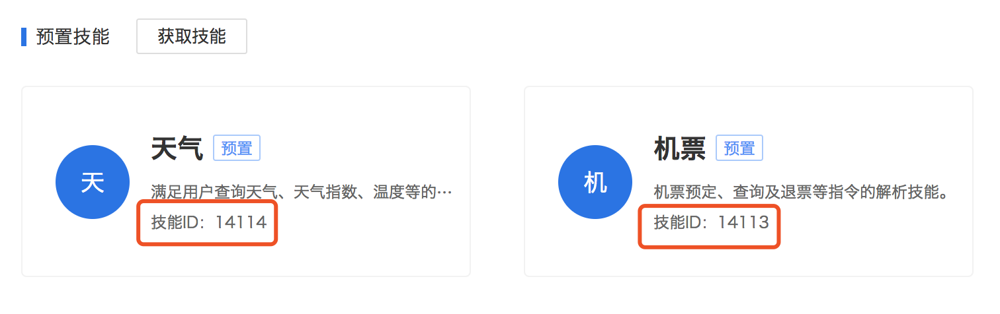
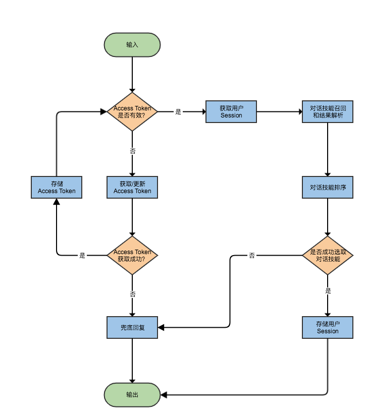

# US Kit 使用示例 (demo)

## 差旅场景

该示例演示如何使用US Kit实现一个差旅场景下的对话机器人，需要同时支持天气查询、机票预定、酒店预定和闲聊共4个技能的满足。

在进行对话中控的搭建之前，首先我们需要准备好以下4个技能：

### 添加UNIT预置技能
其中，天气、机票和闲聊均为UNIT平台的预置技能，可以在平台上直接进行添加。

1. 进入[百度理解与交互平台(UNIT)>我的技能](http://ai.baidu.com/unit/v2#/sceneliblist)
2. 点击获取技能，依次获取天气、机票和闲聊3个技能，获取成功后可以在我的技能中查看每个技能的技能ID，如下图红框圈出：


### 添加自定义技能
酒店预定技能可以通过UNIT平台进行自定义技能配置，具体的配置方式参考DM Kit[示例文档](https://github.com/baidu/unit-dmkit/blob/master/docs/demo_skills.md)

### 使用US Kit搭建对话机器人

在我们开始之前，梳理一下机器人中控需要完成的工作和策略：

1. 接入天气、机票、酒店和闲聊4个技能，完成与[UNIT 2.0协议](https://ai.baidu.com/docs#/UNIT-v2-dialogue-API/top)的对接(backend.conf)
2. 技能的并行召回和解析抽取，根据远程服务通信是否成功，错误码是否为0判断是否成功召回技能(backend.conf)
3. 多技能结果的排序，在这个教程中，我们按照`酒店>机票>天气>聊天`的优先级对技能结果进行排序，这是比较简单的排序策略，如需更加复杂的排序策略可以参考[详细配置文档](config.md)(rank.conf)
4. 管理多轮上下文session，记录用户多轮交互结果，对于涉及多轮对话的技能来说这很重要，本教程使用Redis作为session的存储介质，对于每个用户记录对应的session，并将session下发给上一轮被选为最终结果的技能(backend.conf，flow.conf)
5. Access Token的管理，由于访问UNIT平台需要根据access token，并且该token一般是一个月的有效期，因此需要在内存里cache该token，并设置有效期，本教程使用Redis的SETEX命令存储access token并设置超时，并在过期后自动刷新token(backend.conf，flow.conf)

整体的流程图如下：


按照上面的梳理，我们通过编写`backend.conf`，`rank.conf`和`flow.conf`3个配置，即可实现一个多技能满足的差旅机器人:

#### backend.conf
以添加UNIT天气技能为例：

策略：定义请求UNIT平台服务的地址、通信协议、超时等选项，以及UNIT协议请求模板和结果解析模板策略，完成后引用模板进行天气技能的定义(只需额外定义技能对应的id)

```
backend {
    name : "unit_backend"
    # 将server修改为你的服务器地址
    server : "https://aip.baidubce.com"
    protocol : "http"
    connect_timeout_ms : 500
    timeout_ms : 3000
    max_retry : 1

    request_template {
        name : "unit_request_template"

        http_method : "post"
        http_uri : "/rpc/2.0/unit/bot/chat"

        http_header {
            key : "Content-Type"
            value : "application/json"
        }

        ...

        http_body {
            key : "bot_id"
            expr : "$bot_id"
        }
    }

    response_template {
        name : "unit_response_template"
        
        if {
            cond : "get($response, 'error_code') == 0"
            cond : "get($response, 'result/response/action_list/0/type') == 'event'"

            ...

            output {
                key : "session/bot_session"
                expr : "get($response, 'result/bot_session', '')"
            }

            output {
                key : "session/bot_id"
                expr : "$bot_id"
            }
        }
    }

    service {
        name : "weather_11111"
        request {
            def {
                key : "bot_id"
                value : "11111"
            }
            include : "unit_request_template"
        }

        response {
            def {
                key : "bot_id"
                value : "11111"
            }
            include : "unit_response_template"
        }
    }
}
```

#### rank.conf
按照上文提到的排序规则进行定义：

策略：酒店>机票>天气>聊天>聊天

```
rank {
    name : "skill_rank"
    order: "hotel_44444"
    order: "flight_22222"
    order: "weather_11111"
    order: "talk_33333"
}
```

#### flow.conf
按照流程图里依次定义流程节点，这里以召回对话技能节点为例：

策略：并发召回上文提及的4个技能，并按照`rank.conf`中定义的排序规则进行排序，选择top1技能作为结果输出，如果4个技能均未召回，那么调整到兜底回复节点

```
flow {
    name : "recall_skill"
    recall: "hotel_44444"
    recall: "flight_22222"
    recall: "weather_11111"
    recall: "talk_33333"

    rank {
        rule : "skill_rank"
        top_k : 1
    }

    if {
        cond : "len($rank) == 1"
        output {
            key : "skill"
            expr : "get($rank, '0')"
        }
        output {
            key : "value"
            expr : "get($backend, get($rank, '0') + '/data')"
        }
        next : "set_session"
    }

    next : "default"
}
```

为了方便开发者快速体验，本教程还提供了配置生成脚本`conf_generator.py`(位于_build/conf/us/demo目录下)，开发者只需修改同目录下的options.py，将对应的服务器地址、技能id、API Key和Secret Key等进行替换：

```
# -*- coding: utf-8 -*-

options = {
    # server address
    # 服务器地址
    'redis_server' : '127.0.0.1:6379',
    'dmkit_server' : '127.0.0.1:8010',
    'unit_server' : 'https://aip.baidubce.com',

    # skill ids
    # 填写每个技能对应的技能id
    'unit_skill_id' : {
        'weather' : '11111',
        'flight' : '22222',
        'talk' : '33333'
    },

    'dmkit_skill_id' : {
        'hotel' : '44444'
    },


    # rank order
    # 按照数组从左到右的优先级进行排序
    'rank' : ['hotel', 'flight', 'weather', 'talk'],

    # access token
    # 查看百度AI开放平台文档了解如何获取API Key和Secret Key: http://ai.baidu.com/docs#/Begin/top
    'api_key' : 'your_api_key',
    'secret_key' : 'your_secret_key'
}
```

然后运行`python conf_generator.py`即可生成US Kit所需的`backend.conf`，`rank.conf`和`flow.conf`3个配置文件：

```
cd _build/conf/us/demo
# edit opitons.py...
python conf_generator.py
cd ../../../
./uskit
```

另外，由于我们使用了Redis作为存储介质，因此还需要在你的机器上安装Redis并启动服务，可以通过搜索引擎查找你的系统相对应的安装方法，这里不再赘述。安装并启动后，可以通过以下方式验证Redis服务是否正常工作：

```
> redis-cli ping
PONG
```

如果返回PONG说明正常。

发起请求：

```
curl -H "Content-type: application/json" -d '{"usid":"demo","logid":"123456","query":"我想订酒店","uuid":"123"}' http://127.0.0.1:8888/us
```

一切正常的话，你应该可以看到以下结果：

```
{"error_code":0,"error_msg":"OK","result":{"value":"请问您要预订哪一天的酒店？","skill":"hotel_44444"}}
```

到此为此，我们就实现了一个差旅场景下的对话机器人，更深入学习US Kit的配置和其他用法可以参考[详细配置说明](config.md)和[配置表达式运算](expression.md)
